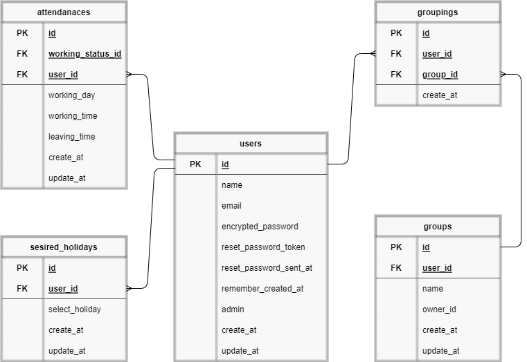
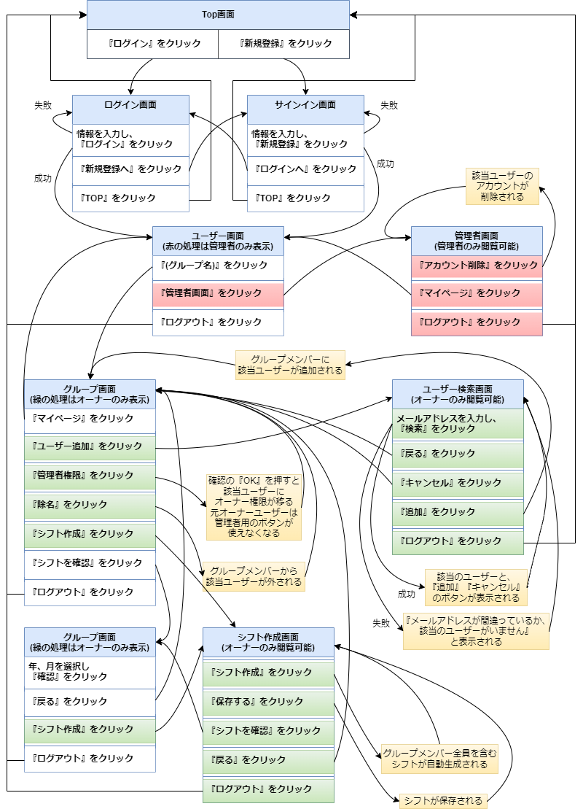
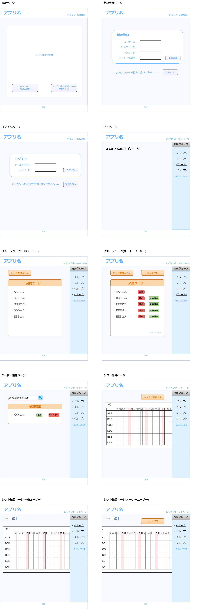

# README

## 開発言語
  - Ruby 3.0.1
  - Ruby on Rails 6.1.6

## 就職Termの技術
  - AWS EC2
  - devise

## カリキュラム外の技術
  - Active Hash

## 実行手順
    $ git clone git@github.com:cha-ri-bi-nzu/sotsugyou_kadai.git
    $ cd sotsugyou_app
    $ bundle install
    $ yarn install
    $ rails db:create
    $ rails db:migrate
    $ rails db:seed
    $ rails s

## カタログ設計
  https://docs.google.com/spreadsheets/d/1yQrJ6jt_CIlUBfRTF-U0KDcIYWD3LDYFfQgl7hAZOoI/edit#gid=782464957

## テーブル定義書
  https://docs.google.com/spreadsheets/d/1yQrJ6jt_CIlUBfRTF-U0KDcIYWD3LDYFfQgl7hAZOoI/edit#gid=2020033787

## ER図
  

## 画面遷移図
  

## ワイヤーフレーム
  
  
